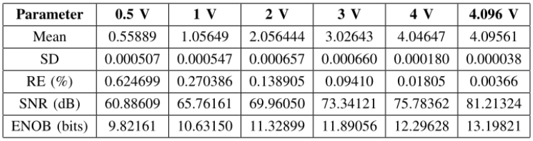
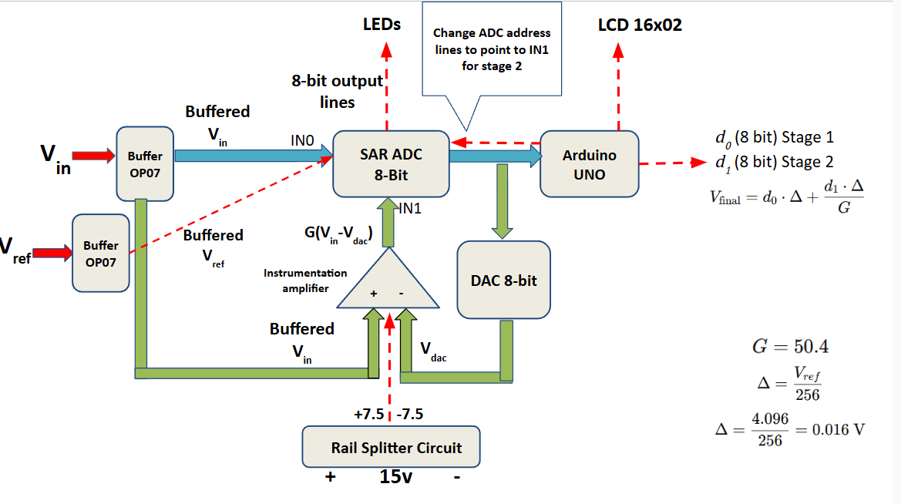
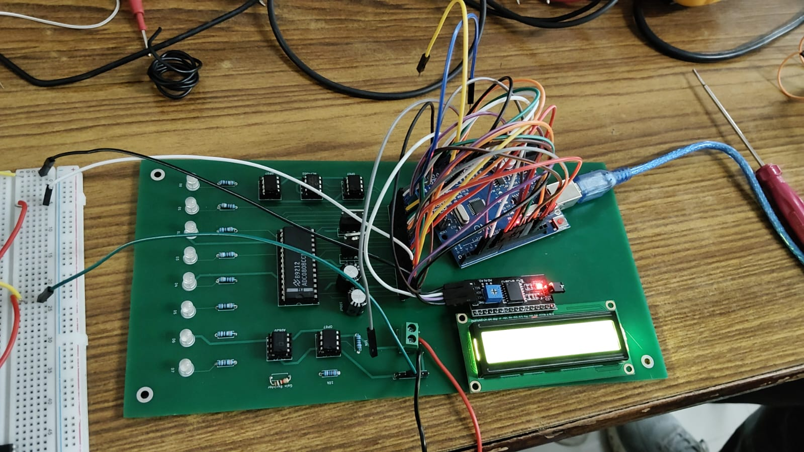

# Hardware Implementation for Enhancement of 8-bit ADC Resolution

A B.Tech project at the Indian Institute of Technology Roorkee focused
on experimentally validating a hardware-based error-correction technique
to improve the effective resolution of an 8-bit ADC.

Project Grade: 10/10 

Supervisor: [Prof. Kishor Bhaskarrao Nandpurkar](https://iitr.ac.in/Departments/Electrical%20Engineering%20Department/People/Faculty/101085.html)

## Overview

Analog-to-Digital Converters (ADCs) are widely used in applications such
as cell phones, robotics, data acquisition systems, programmable logic
controllers, and audio/video devices.

This project investigates a method for improving the resolution of an
8-bit ADC without replacing it with a higher-resolution ADC. The
approach amplifies the first-stage quantization error and feeds the
amplified error back into the ADC for a second conversion.

## Core Methodology

For an 8-bit ADC, the voltage step size is:

    Δ = VREF / 2^8 = VREF / 256

The first ADC conversion produces a digital output corresponding to the
input voltage.

The corresponding analog value is reconstructed using a DAC:

    VDAC

The quantization error is then:

    E = Vin - VDAC

Instead of discarding this error, the project amplifies it by a gain G:

    Vin' = G × (Vin - VDAC)

The amplified error is converted again using the same 8-bit ADC,
producing a second digital output D2.

The original input can then be reconstructed using:

    Vin = (Δ × D2 / G) + VDAC

This effectively makes the second conversion resolve a much smaller
portion of the original input range.

Hardware Implementation

The implementation uses:

-   ADC0808 — 8-bit SAR ADC
-   MCP4802 — external DAC for reconstructing VDAC
-   AD620 — instrumentation amplifier used for amplification of the
    error
-   OP07 — operational amplifier circuitry
-   Arduino UNO — digital control/interface

## Results

## Circuit Architecture

## [Video Demo link](https://drive.google.com/file/d/1kQSypfHagTtcMN4RbzN2FQdbuqBrhnZS/view?usp=sharing)

## PCB 

